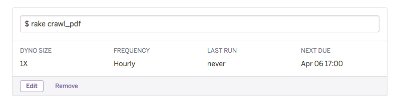

# CCC Privacy Crawler
Tカードの [個人情報提供の停止 対象企業一覧](https://ssl.help.tsite.jp/faq/show/43526?category_id=4281&site_domain=qa-tsite) の新着を通知するためのTwitterボットです

* Twitter: https://twitter.com/ccc_privacy_bot
* Twilog: http://twilog.org/ccc_privacy_bot
* webアプリ: https://ccc-privacy-crawler.herokuapp.com/

[](https://github.com/sue445/ccc_privacy_crawler/actions/workflows/build.yml)
[](https://circleci.com/gh/sue445/ccc_privacy_crawler/tree/heroku)
[](https://codeclimate.com/github/sue445/ccc_privacy_crawler)
[](https://coveralls.io/r/sue445/ccc_privacy_crawler)

## Requirements
* Ruby

## Setup
* create twitter app and generate access token
  * https://apps.twitter.com/

```bash
cp .env{.example,}
vi .env

bundle install
bundle exec padrino rake ar:create ar:migrate
```

## Run development
run local server

```bash
bundle exec padrino s
open http://localhost:3000/
```

run crawler

```bash
bundle exec rake crawl_pdf
```

## Test
```bash
RACK_ENV=test bundle exec rake ar:migrate
bundle exec rspec
```

## Setup Heroku
```bash
heroku config:set TWITTER_CONSUMER_KEY=xxxxxxxxxxxxxxxxxx
heroku config:set TWITTER_CONSUMER_SECRET=xxxxxxxxxxxxxxxxxx
heroku config:set TWITTER_ACCESS_TOKEN=xxxxxxxxxxxxxxxxxx
heroku config:set TWITTER_ACCESS_TOKEN_SECRET=xxxxxxxxxxxxxxxxxx
heroku config:set NEWRELIC_LICENSE_KEY=xxxxxxxxxxxxxxxxxx
```

## Heroku deploy
[](https://heroku.com/deploy)

register `rake crawl_pdf` to [Heroku Scheduler](https://addons.heroku.com/scheduler)


