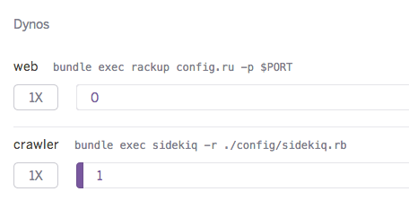

# CCC Privacy Crawler
Tカードの [個人情報提供の停止 対象企業一覧](http://qa.tsite.jp/faq/show/25129) の新着を通知するためのTwitterボットです

https://twitter.com/ccc_privacy_bot

[](https://circleci.com/gh/sue445/ccc_privacy_crawler/tree/master)
[](https://gemnasium.com/sue445/ccc_privacy_crawler)
[](https://codeclimate.com/github/sue445/ccc_privacy_crawler)
[](https://coveralls.io/r/sue445/ccc_privacy_crawler)

## Requirements
* Ruby 2.1.5
* redis (for scheduler)

## Setup
* create twitter app and generate access token
  * https://apps.twitter.com/

```bash
cp config/database.yml{.example,}
vi config/database.yml
cp .env{.example,}
vi .env

bundle install
bundle exec padrino rake ar:create ar:migrate
```

## Run development
```bash
bundle exec padrino r "PdfCrawlWorker.new.perform"
```

## Test
```bash
RACK_ENV=test bundle exec rake ar:migrate
bundle exec rspec
```

## Setup Heroku
```bash
heroku config:set TWITTER_CONSUMER_KEY=xxxxxxxxxxxxxxxxxx
heroku config:set TWITTER_CONSUMER_SECRET=xxxxxxxxxxxxxxxxxx
heroku config:set TWITTER_ACCESS_TOKEN=xxxxxxxxxxxxxxxxxx
heroku config:set TWITTER_ACCESS_TOKEN_SECRET=xxxxxxxxxxxxxxxxxx
heroku config:set NEWRELIC_LICENSE_KEY=xxxxxxxxxxxxxxxxxx
heroku config:set REDIS_PROVIDER=REDISTOGO_URL
```

## Heroku deploy
[](https://heroku.com/deploy)

Note: Change Dyno count

* web: 1 -> 0
* crawler: 0 -> 1


